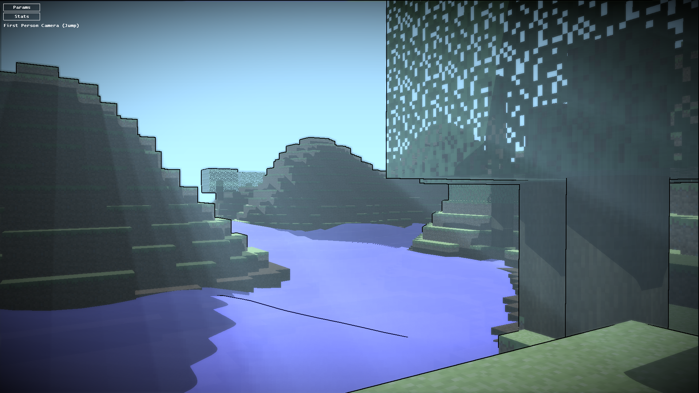

<h2><b>AIMinicraft</b></h2>

An ecosystem with up to 12 different AI creatures, in a recreation of a Minecraft world using OpenGL.
Each type of creature is represented by a cube and a color, and they use a state machine for their behaviours. Most code done for the project is done in <b>Minicraft/src/creatures</b>.

Based on a C++ engine given by the CNAM-ENJMIN (hence why most code is done in headers).

<b>This was made as a group project at the CNAM-ENJMIN.</b>

I worked on:
- The state-machine base for all the creatures
- The management of all the creatures
- The behaviours of the bird and the fruit system

